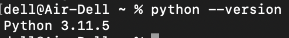

# ASKII_ALgorithm-SFML-wxWidgets
MyPortfolio

# Building for MacOS  
To download homebrew type this command(if you do have a brew you do not need this commmand): 
```console
/bin/bash -c "$(curl -fsSL https://raw.githubusercontent.com/Homebrew/install/HEAD/install.sh)"
```
if you don't have installed cmake type in console the next command: 
```console
brew install cmake
```
After that you should setup a pyhton:
```console
brew install python
```
You can check your python version by simple type(we need Python3):
```console
python --version
```
if this what you see that means that everything alright:
***

***
Now lets setup a conan. To setup a conan you should type. We need version below 2.00:
```console
pip install -v "conan<2"
```
After that we can check our conan verison by simply type:
```console
conan --version
```
If you see that result that means that everything is alright and we inastalled our 1.61.0 version of conan:
```console
Conan version 1.61.0
```
Go to that repository directory throuh trminal with command:
```console
cd "[This repository directory]"
```
Type a command:
```console
mkdir build
```
Type that command to install needed .cmake files in build directory. Remember that any packages that you are installing are installs in .conan folder:
```console
cd build && conan install .. --build=missing
```
The last step is to open a downloaded local repository folder from terminal and type next commands (step by step): 
```console
cmake ..
make
```
And finaly you can run compiled script with command:
```console
./ASKII
```
# Building for Windows
